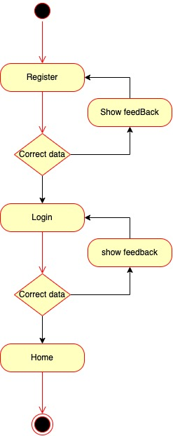
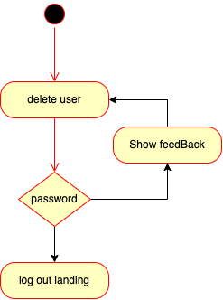
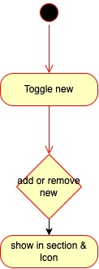
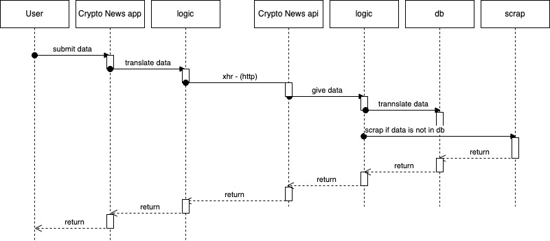
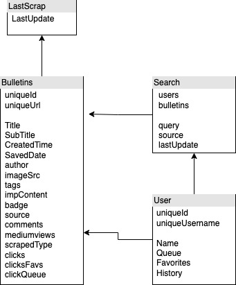

# Crypto Hot News

## Introduction

## Functional description

CryptoHotNews is an application that allows its users to have outstanding news from the most important media in the sector in one place. As well as searching in the same media for the most outstanding news on any subject through scribing the media and saving the news found in the database.

### Use cases

### Activities

#### Register and Login

#### Delete User

#### Search News

#### Toggle Favorites & Queue

## Techinal description

### Block

### Sequences

#### Data user

### Data model

### Techonoliges

<table>
    <row>
        <td>
            
        </td>
        <td>
            
        </td>
        <td>
            
        </td>
        <td>
            
        <td>
        <td>
            
        </td>
        <td>
            
        </td>
    </row>
</table>

